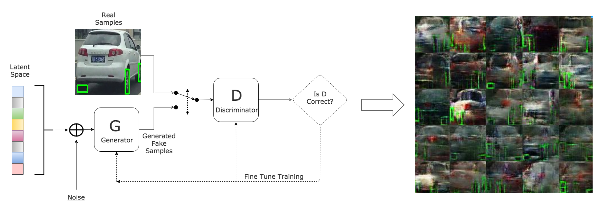

# RIPS-HK: Semi-supervised Learning for Visual Semantics
> [**Research in Industrial Projects for Students (RIPS-HK)**](https://www.math.ust.hk/~rips/ripshk.html) is a summer research plus industrial internship and international education exchange program launched by the **UCLA Institute of Pure and Applied Mathematics (IPAM)** and **HKUST Mathematics Department**.
>
> This project is sponsored by [Using.ai](https://using.ai/) and completed by [Andy Kang](https://github.com/AndyKANG98) from HKUST, [Biraj Pandey](https://github.com/birajpandey) from UT Austin, [Bob Wang](https://github.com/bobwzy) from CUHK, and [Caitlin Shener](https://github.com/caitlinosh) from UCLA. We explored the deep learning models to implement tire detection and several ways to expand the limited data set.

## Problem Background

This project aims to recognize tires in photographs using deep learning and semi-supervised
learning methods. Given a photo of a vehicle, our models should accurately output bounding
boxes for each tire. We were given about 600 images of cars with labels.

> A sample of the **input training image** (left), and the **output coordinates** of the
> wheels detected (right) 

The first part of the project was implementing tire detection with traditional deep learning models, which can be found in the `Tire-Detection`  folder. However, the amount of labeled data is limited and in a low quality. So, we need to further expand the data set in order to improve the performance of tire detection model, which can be found in `WGAN` and `OIDv4_ToolKit`.

## Tire Detection Implementation

The implementation can be found in [`Tire-Detection`](./Tire-Detection). We applied transfer learning methods based on the pretrained model in [TensorFlow Object Detection API](https://github.com/tensorflow/models/tree/master/research/object_detection). The result was satisfied with in the test images provided but bad in some test samples from videos recorders. By observing the training set, we found that the amount of training data is small and the images are similar to each other. Then the model showed the features of overfitting. So we need to somehow expand the data set.

## Data Generation by [GAN](https://arxiv.org/abs/1406.2661)

[**Generative Adversarial Networks(GANs)**](https://arxiv.org/abs/1406.2661) is a common way to generate adequate images based on some random noise. We used [Wasserstein GAN](https://arxiv.org/abs/1701.07875)(WGAN), an improved version of GAN to train our model. The work can be found in [`WGAN`](./WGAN). The generated pictures are all in low resolution and can not be used to improved the original tire detection model. But the ideas of generating both labeled and unlabeled data are worth to be considered in the future work of training.

> Figure: Structure of GAN to generate labeled samples of cars.

## Open-Image Data Set Downloading

 [Open Images Dataset v4](https://storage.googleapis.com/openimages/web/index.html) provide a large amount of high-quality labeled images for object detection training. There exists millions of pictures with 600 object classes as open resources, which should be a proper way to expand and improve the performance of object detection model. The method of downloading specific class of images is shown in [`OIDv4_ToolKit`](./OIDv4_ToolKit).

## Conclusion and Future Work

We have demonstrated the application of supervised learning for our specific task of tire detection. Specifically, we implemented Faster RCNN and SSD object detection models. Although we achieved high accuracy scores, the trained models show signs of severe over-fitting. Their performance on novel real world images falls well below their performance on the training data set. 

We propose two reasons for this phenomenon. Firstly, the quality of the training set could be affecting the model’s capacity to generalize to novel images. Our training images suffer from being too similar for the model to learn general features. Secondly, these CNN models require labeled images in the order of tens of thousands to learn accurately and generalize to novel images. Our dataset is limited to only 600 images. 

The quality of the dataset is something that cannot be changed. Hence, the first problem would be unsolvable without collecting new data. To alleviate the second problem, we propose a semi-supervised learning framework for training these CNN models. To be specific, the CNN models can be trained with a mixture of labeled and unlabeled data to improve their performance. Additionally, we have also demonstrated the proof of concept of generating labeled images of tires using GANs. 

To further improve the detection model, we should implement GANs to generate high quality images, either labeled or unlabeled, and feed the data back to the training data set of object detection. Another simple way is to expand the original data set with images from Open-Image online resources. Both ideas are worth trying in the future work.