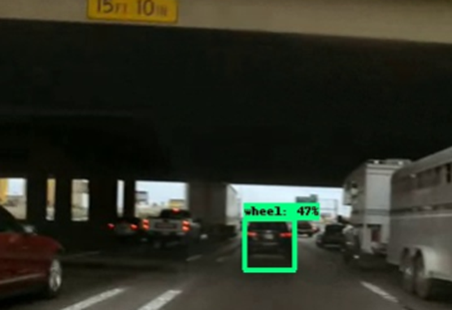

# Tire Detection
> This part is forked and modified from: [Playing Quidditch using the TensorFlow Object Detection API](https://github.com/thatbrguy/Object-Detection-Quidditch). Checkout this [post](https://medium.freecodecamp.org/how-to-play-quidditch-using-the-tensorflow-object-detection-api-b0742b99065d) for instructions on how to use this repo. It mainly used [TensorFlow Object Detection API](https://github.com/tensorflow/models/tree/master/research/object_detection)

We applied the transfer learning method on the Tensorflow Object Detection API fine-tuned with our own data set. We split 591 labeled images into 70% for the training, 15% for the validation, and 15% for testing. We trained with ssd mobilenet v2 coco and faster rcnn inspection v2 coco models provided by the object detection API. Here some samples of the results in the testing sets.

> Tire Detection Results Sample: Note the high accuracy of tire detection on the testing
> data.

The performance of the model was evaluated by precision and recall, which are calculated based on the Intersection over Union (IoU). 

| ssdlite mobilenet v2 | faster rcnn inception v2 |          |
| -------------------- | ------------------------ | -------- |
| Speed (ms/image)     | 167.551                  | 1164.607 |
| Recall               | 0.8244                   | 0.952036 |
| Precision            | 0.9391                   | 0.8878   |

> Results table for object detection: SSD has a higher detect speed, lower recall and higher
> precision than Faster R-CNN. Both detection models show strong performance on test data set.

However, when the model was implemented on a video of cars on the street, the prediction boxes were distinctly less accurate. Further inspection of the training data set revealed that most of the images look fairly similar. Namely, the photos captured the vehicles from side and back angles, but they were not entirely reflective of all possibilities seen on real streets. This could be a reason why the model performed so poorly. In the following experiments, we tried GANs with semi-supervised learning ideas and other open image resources to expand on and further generalize the data set.

  

> Sample of result when the trained model was implemented on the videos from the recorder of cars. Note the wrong prediction of detecting the car as a tire.