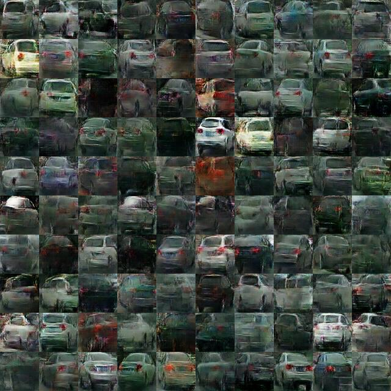
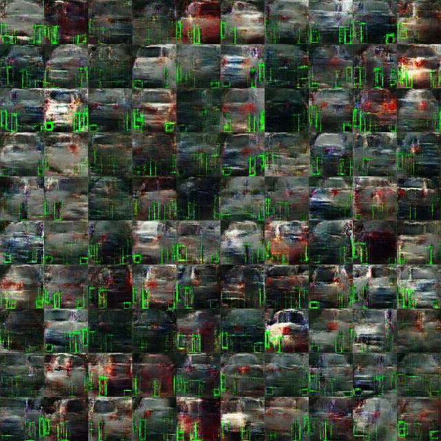

# WGAN

> To further expand the data set and ultimately improve the performance of the object detection model, we used the original data set and trained WGAN ([Improved Training of Wasserstein GANs](https://arxiv.org/pdf/1704.00028.pdf)) to generate more data. The code was forked and modified from: [DCGAN-LSGAN-WGAN-WGAN-GP-Tensorflow](https://github.com/LynnHo/DCGAN-LSGAN-WGAN-WGAN-GP-Tensorflow)

 

## Model Implementation

* models_64x64
  * Build the model of generator and discriminator which can generate and process the images of 64*64
* train_wgan_gp.py
  * Set the corresponding parameters `epoch` (epochs of training)
  * Run `python train_wgan_gp.py` in the terminal to train the improved WGAN model
* WGAN-GAN Restore.ipynb
  * Restore the generator to generate large amount of data from the checkpoints

 

## Result Evaluation

* Sample after 1600 steps of training: 

  

>  The above samples are in low resolution and quality, not qualified to become the training data for the object detection model. However, even if the resolution is high, we can hardly use the "unlabeled data" to expand the training set. So we came up with the idea of generating "visualized labeled data.

 

* Samples of generating "labeled data": 

  

> With the above labeled data in a high quality, we might be able to detect the green color in the images and derive the coordinates of wheels. The idea is worth to be explored in the further work.

