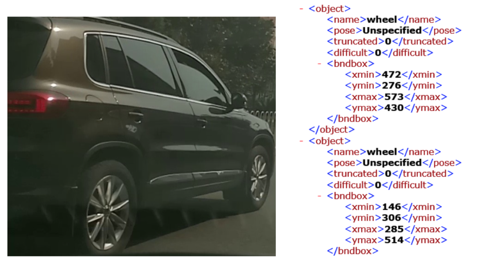

# Data for Tire Detection

* Data is offered by Company [Using.ai](Using.ai) for researching use.
  * Wheel data set contain 600 images

    * img: images of data

    * label: corresponding xml file with the corresponding coordinates of tires

      
